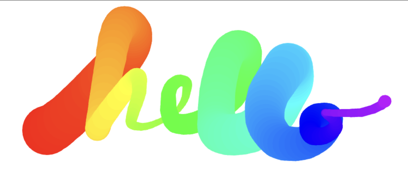

# HTML5 Canvas

## Description

This is the eighth exercise in the Wes Bos JavaScript 30 challenge. We essentially created a doodle pad where our pointer controls a line that varies in color and thickness.

- My motivation was to continue to build my skillset
- This exercise provided a lot of room for experimentation and I spent a good chunk of time digging into different options for the context.
- The most interesting part of this was what a different product it is without setting the X and Y values on mousedown.

## Usage

The page will appear blank on load. Click and move your pointer to begin drawing. The line thickness and color will change as you draw more,

[Live Canvas Page](https://katemcro.github.io/canvasJS30_08/)

## Credits

This project is from Wes Bos' free [#JavaScript30](https://javascript30.com/) coding challenge.
